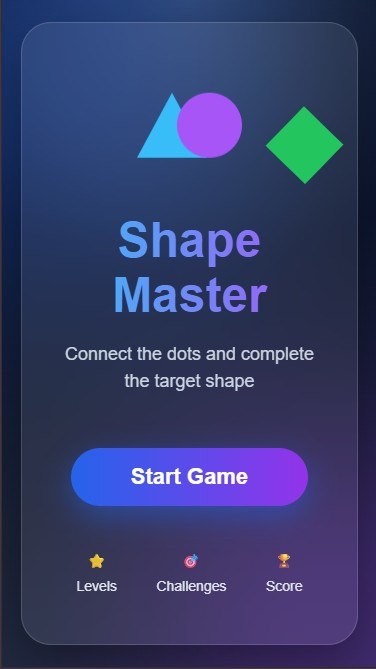
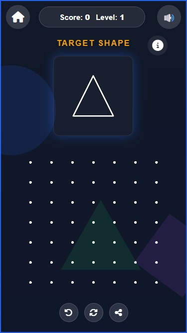
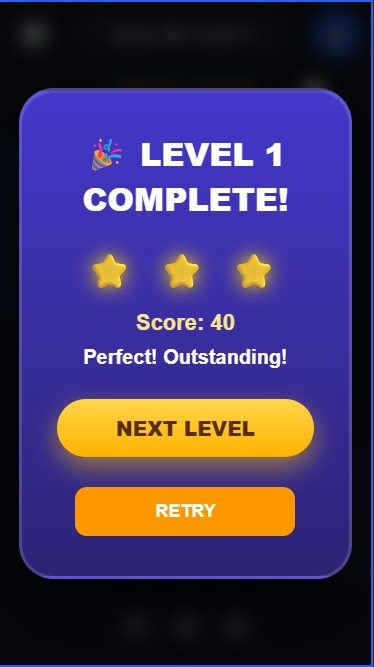

# 🎮 Shape Game

A fun and interactive **Shape Matching Game** built with **HTML5 Canvas, JavaScript, HTML, and CSS**. Players recreate the target shape by connecting dots, earning points and unlocking new levels as they progress.

---

## 🚀 Live Demo

> Add your deployed game link here.

**Demo:** https://shape-game-gamma.vercel.app

---

## 📸 Preview

> Add screenshots or GIFs here.

| Home Screen | Gameplay | Level Complete |
|-------------|----------|----------------|
|  |  |  |

---

## ✨ Features

- 🎯 Shape matching gameplay
- ⭐ Score tracking
- 📈 Progressive levels
- 💡 Clue system
- 🔄 Retry level
- 🔊 Background music & sound effects
- 🏆 Level complete animation
- ❌ Wrong answer popup
- 📱 Fully responsive
- 🎨 Modern UI
- 👆 Touch & mouse support

---

## 🛠️ Tech Stack

- HTML5
- CSS3
- JavaScript (ES6 Modules)
- HTML5 Canvas

---

## 📂 Folder Structure

```text
Shape-Game
│
├── assets
│   ├── images
│   └── sounds
│
├── js
│   ├── audio.js
│   ├── canvas.js
│   ├── dots.js
│   ├── game.js
│   ├── main.js
│   ├── shapes.js
│   └── ui.js
│
├── index.html
├── style.css
└── README.md
```

---

## 🎮 How to Play

1. Observe the target shape.
2. Connect the dots in the correct order.
3. Complete the shape.
4. Earn points.
5. Unlock the next level.
6. Use the clue button if needed.

---

## ⚙️ Installation

Clone the repository:

```bash
git clone https://github.com/SamiaBaly/shape-game
```

Go to the project directory:

```bash
cd Shape-Game
```

Run with **Live Server** or any local web server.

---

## 📋 Roadmap

- [x] Dot connection system
- [x] Multiple shapes
- [x] Level progression
- [x] Score system
- [x] Sound effects
- [x] Responsive layout
- [ ] More levels
- [ ] Leaderboard
- [ ] Save progress
- [ ] Dark/Light theme

---

## 🤝 Contributing

Contributions are welcome!

1. Fork the repository.
2. Create a feature branch.
3. Commit your changes.
4. Push to your branch.
5. Open a Pull Request.

---

## 👩‍💻 Author

**Samia Baly**

- GitHub: https://github.com/SamiaBaly
- LinkedIn: https://www.linkedin.com/in/samia-baly/

---

## 📄 License

This project is licensed under the **MIT License**.

---

⭐ **If you like this project, please give it a Star!**